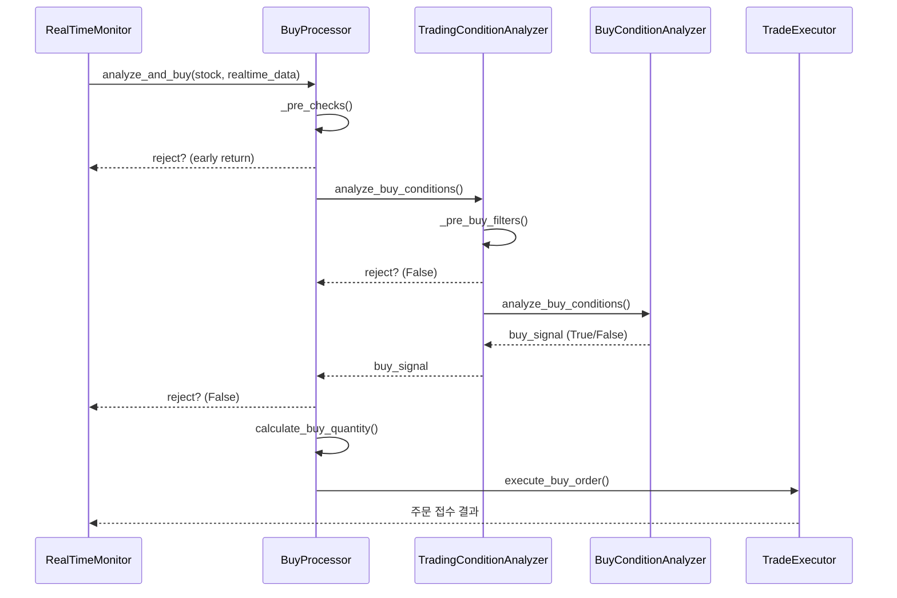

# 매수 판단 로직 문서

## 1. 목적 및 적용 범위
본 문서는 알고리즘 트레이딩 시스템에서 **실시간 주식 매수 여부**를 결정하는 로직의 구조와 세부 동작을 설명합니다. 대상 코드는 `trade/*` 및 `trade/realtime/*` 하위 모듈에 구현된 매수 관련 컴포넌트이며, 실제 주문은 KIS OpenAPI 를 사용합니다.

## 2. 주요 클래스·파일 위치
| 레이어 | 클래스 / 모듈 | 주요 책임 |
| ------ | ------------- | -------- |
| Realtime Monitor | `trade/realtime/buy_processor.py` (`BuyProcessor`) | 종목별 실시간 매수 분석·주문 실행 파이프라인 |
| Condition Analysis | `trade/trading_condition_analyzer.py` (`TradingConditionAnalyzer`) | 시장 단계 판단, 1차 필터, 세부 분석 위임 |
| Condition Scoring | `trade/buy_condition_analyzer.py` (`BuyConditionAnalyzer`) | 종합 점수 계산(0~100) 및 매수 시그널 반환 |
| Order Execution | `trade/trade_executor.py` (`TradeExecutor`) | 리스크 점검 후 KIS API 매수 주문 |

## 3. 전체 흐름도

## 4. 단계별 상세 설명
### 4-1. BuyProcessor 선행 체크 (`_pre_checks`)
1. **보유·주문 상태**: 이미 매수완료/주문접수/부분체결된 종목 제외
2. **중복 쿨다운**: 최근 매수 후 `duplicate_buy_cooldown`(기본 10초) 미경과 시 제외
3. **장 마감 임박**: `performance_config.pre_close_hour:minute`(기본 14:50) 이후 신규 매수 금지
4. **포지션 한도**: 현재 보유 수 ≥ `risk_config.max_open_positions` 시 제외
5. **실시간 데이터 필수**: 현재가(`current_price`) ≤ 0 이면 제외

### 4-2. TradingConditionAnalyzer 1차 필터 (`_pre_buy_filters`)
| 항목 | 조건 | 기본 임계값 | 설명 |
| ---- | ----- | ---------- | ---- |
| 호가 비율 | `bid_qty / ask_qty` ≥ **min_bid_ask_ratio_for_buy** | 1.2 | 매수 호가 우위 필터 |
| 호가 과매도 | `ask_qty / bid_qty` < **max_ask_bid_ratio_for_buy** | 2.5 | 매도 호가 과다 차단 |
| 매수비율 | `buy_ratio` ≥ **min_buy_ratio_for_buy** | 40 % | 매수 체결 비중 |
| 체결강도 | `contract_strength` ≥ **min_contract_strength_for_buy** | 110 | 실시간 매수 우세 |
| 등락률 | `price_change_rate` < **max_price_change_rate_for_buy** | 15 % | 상한가 근접 차단 |
| 유동성 | `liquidity_score` ≥ **min_liquidity_score_for_buy** | 3.0 | 내부 계산 유동성 지표 |

통과 시 **2차 정밀 분석** 단계로 진입합니다.

### 4-3. BuyConditionAnalyzer 종합 점수화
| 카테고리 | 세부 항목 | 점수 범위 | 요약 |
| -------- | -------- | -------- | ---- |
| 기본 체크 | 거래정지·VI·가격·데이터 품질 등 | 탈락/통과 | 실패 시 즉시 Reject |
| Momentum | 가격 상승률·거래량 급증·체결강도 | 0-40 | 시장 단계 보정(Opening +10 %, Pre-close −10 %) |
| Divergence | 20일선 이격도 + 일중 위치 | 0-25 | 과매도·고점/저점 위치 가산 |
| Time | 시장 단계 + 분 단위 패턴 + 거래 활발도 | 0-15 | 장 초반·정각 등 가중 |
| Orderbook | 매수/매도 잔량 불균형 | 0-10 | 매수 잔량 우위 높을수록 + |
| Contract | 매수 체결 비중 | 0-8 | 70 % 이상이면 만점 |
| Volume | 회전율·전일 동시간 대비 | 0-7 | 활발 +1 (Opening) |
| 보너스 | 매수비율·패턴 점수 | 각 0-10 | 설정 임계 초과 시 추가 |

#### 시장 단계별 요구 점수
| Phase | 최소 Momentum | 최소 TotalScore | 매수비율 min | 패턴 점수 min |
| ----- | ------------- | --------------- | ------------ | ------------- |
| opening | 20 | 70 | 60 ×1.1 | 75 |
| normal  | 15 | 60 | 60 | 70 |
| pre_close | 25 | 75 | 60 ×1.2 | 75 |

≥ 모든 임계값 충족 시 **매수 신호(True)** 반환.

### 4-4. 매수 수량 계산 (`calculate_buy_quantity`)
1. 기본 투자금: `risk_config.base_investment_amount` (예 1,000,000원)
2. 계좌 잔고 비율 사용 시 총 자산 × `position_size_ratio`
3. 시장 단계별 축소: Opening 50 %, Pre-close 30 %
4. 포지션 과다 시 `conservative_ratio` (예 0.7) 적용
5. 단일 포지션 상한 `max_position_size` 이하로 제한
6. 수량 = 투자금 / 현재가 (최소 1주 보장)

### 4-5. TradeExecutor 리스크 검증 & 주문 실행
* 일일 손실 한도(`max_daily_loss`)·거래 횟수·포지션 수·단일 포지션 크기 검증
* KIS OpenAPI `get_order_cash(ord_dv="buy", ...)` 로 현금 매수 주문
* 주문 성공 시 `StockStatus.BUY_ORDERED` 및 손절가/익절가 자동 설정

## 5. 핵심 설정(抜粹)
| Config 파일 | 키 | 기본값 | 설명 |
| ------------ | -- | ------ | ---- |
| `performance_config` | min_bid_ask_ratio_for_buy | 1.2 | 1차 필터 – 매수호가 우위 최소치 |
| 〃 | max_price_change_rate_for_buy | 15 | 급등 차단 상한(%) |
| 〃 | buy_score_normal_threshold | 60 | Normal 단계 최소 총점 |
| `risk_config` | base_investment_amount | 1,000,000 | 기본 투자금액(원) |
| 〃 | max_open_positions | 10 | 동시 보유 최대 종목 수 |
| 〃 | max_position_size | 1,000,000 | 단일 포지션 최대 금액(원) |
| 〃 | max_daily_loss | -100,000 | 일일 손실 한도(원) |

> 실제 값은 `config/trading_config.ini` 및 환경별 설정 파일에서 변경 가능합니다.

## 6. 참고용 개선 아이디어
* **강화학습 기반 파라미터 튜닝** – 다일리 백테스트 결과를 자동으로 반영
* **리스크 동적 조정** – 변동성·시장지수 대비 실시간로 스탑·목표가 갱신
* **멀티스레드 최적화** – 매수 판단 병렬화로 레이턴시 단축

---
문서 업데이트 : {{date}} 