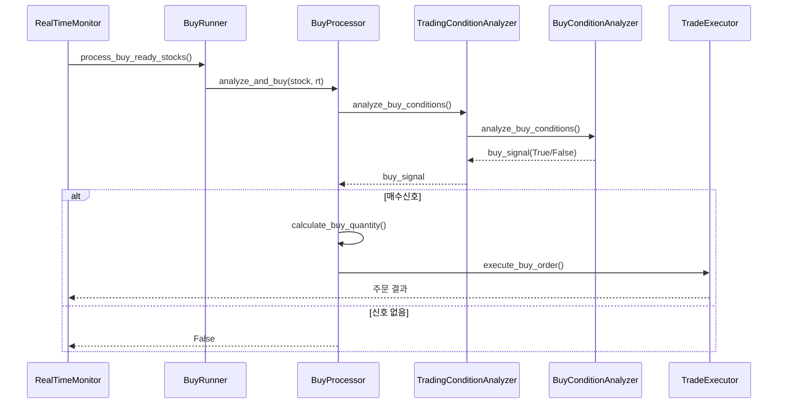

# 매수신호 상세 로직 문서

> 버전 1.0 / 작성 {{date}}
>
> 관련 모듈 : `trade/realtime/buy_runner.py`, `trade/realtime/buy_processor.py`, `trade/trading_condition_analyzer.py`, `trade/buy_condition_analyzer.py`, `trade/trade_executor.py`

---

## 1. 전체 파이프라인 개요


---

## 2. 실시간 데이터 필드 정의
`models.stock.RealtimeData` 구조 중 **매수 판단**에 직·간접적으로 사용되는 주요 필드입니다.

| 필드 | 설명 | 사용 단계 | 주요 임계값/비고 |
| --- | --- | --- | --- |
| `current_price` | 현재가 | 전 단계 | 0 초과 필수 |
| `bid_price / ask_price` | 매수·매도 1호가 | 적격성·1차 필터 | 스프레드 계산 |
| `total_bid_qty / total_ask_qty` | 총 매수·매도 호가 잔량 | 1차 필터·Orderbook 점수 | bid/ask 비율 ≥ 1.0 등 |
| `contract_strength` | 체결강도(100=중립) | 1차 필터·Momentum | ≥ 100 필수, ≥ 110 가산 |
| `buy_ratio` | 전체 체결 중 매수 비중(%) | 1차 필터·Bonus | ≥ 30 필수, ≥ 60 가산 |
| `price_change_rate` | 전일 종가 대비 등락률(%) | 1차 필터·Momentum | < 20 % (limit-up 차단) |
| `volume_spike_ratio` | 전일 동시간 대비 거래량 배수 | Momentum 점수 | ≥ 1.5 가산 |
| `volume_turnover_rate` | 회전율(%) | 적격성·Volume 점수 | ≥ 0.5 필수 |
| `today_volume` | 금일 누적 거래량 | Time·Volume | — |
| `total_bid_qty / total_ask_qty` | 총 호가 잔량 | Orderbook 점수 | — |
| `buy_contract_count / sell_contract_count` | 매수·매도 체결건수 | Contract 점수 | — |
| `trading_halt` | 거래정지 여부 | 적격성 | True → 즉시 Reject |
| `vi_standard_price` | VI 기준가 존재 여부 | 적격성 | > 0 → Reject |
| `hour_cls_code / market_operation_code` | 시간·시장 운영 코드 | 적격성 | 51/52, 30/31 → Reject |

> 설정 파일(`config/trading_config.ini`)을 통해 임계값을 조정할 수 있습니다.

---

## 3. 단계별 로직 상세

### 3-1. 선행 체크 `BuyProcessor._pre_checks()`
1. **보유/주문 상태** : 이미 보유(Bought)·주문접수(BuyOrdered)·부분체결(PARTIAL_BOUGHT) 시 제외
2. **중복 쿨다운** : 최근 매수 `duplicate_buy_cooldown` (기본 10 초) 미경과 시 제외
3. **장 마감 임박** : `performance_config.pre_close_hour:minute` 이후 신규 매수 금지(기본 14:50)
4. **포지션 한도** : 현재 보유 수 ≥ `risk_config.max_open_positions`(기본 10)
5. **필수 데이터** : `current_price` ≤ 0 → 제외

### 3-2. 1차 필터 `TradingConditionAnalyzer._pre_buy_filters()`
| 항목 | 계산식 | 기본 임계값 |
| --- | --- | --- |
| 호가비율 | `bid_qty / ask_qty` | ≥ 1.0 (매수 우위) |
| 매도우위 | `ask_qty / bid_qty` | < 3.0 |
| 매수비율 | `buy_ratio` (%) | ≥ 30 |
| 체결강도 | `contract_strength` | ≥ 100 |
| 등락률 | `price_change_rate` (%) | < 20 |
| 유동성 | `liquidity_score` (별도 계산) | ≥ 2.0 |

통과 시 **적격성 체크** 단계로 이동합니다.

### 3-3. 기본 적격성 `BuyConditionAnalyzer._check_basic_eligibility()`
- 거래정지 / VI 발동 여부
- 실시간 데이터 품질 : 호가/거래량/체결 데이터 중 최소 1 종 존재
- 최소 상승률 `min_price_change_rate_for_buy` (기본 0.3 %)
- 최대 호가 스프레드 `max_spread_threshold` (기본 5 %)
- 최소 체결강도 `min_contract_strength_for_buy` (기본 100)
- 최소 회전율 `min_volume_turnover_rate` (기본 0.5 %)

### 3-4. 종합 점수 시스템 `BuyConditionAnalyzer.analyze_buy_conditions()`
| 카테고리 | 점수 범위 | 주요 로직 |
| --- | --- | --- |
| **Momentum** | 0–40 | 가격 상승률 & 거래량 급증 & 체결강도 |
| **Divergence** | 0–25 | 20일선 이격도 + 일중 위치 보정 |
| **Time Sensitivity** | 0–15 | 시장 단계·분 단위 패턴·거래 활발도 |
| **Orderbook** | 0–10 | 매수/매도 잔량 불균형 |
| **Contract Balance** | 0–8 | 매수·매도 체결건수 불균형 |
| **Volume Quality** | 0–7 | 회전율 + 전일 대비 거래량 |
| **Bonus** | 각 0–10 | 매수비율·패턴 점수 초과분 |

#### 시장 단계별 요구 점수
| Phase | 최소 Momentum | 최소 TotalScore | 매수비율 min | 패턴점수 min |
| --- | --- | --- | --- | --- |
| opening | 20 | 70 | 66 | 75 |
| active (normal) | 15 | 60 | 60 | 70 |
| pre_close | 25 | 75 | 72 | 75 |

≥ 모든 임계값 충족 시 **매수신호(True)** 반환, 이후 3-5단계로 진행합니다.

### 3-5. 매수 수량 계산 `TradingConditionAnalyzer.calculate_buy_quantity()`
1. 기본 투자금 `BASE_INVESTMENT_AMOUNT` (기본 1,000,000 원)
2. **계좌 비율** `USE_ACCOUNT_RATIO=True` 시 총 자산 × `POSITION_SIZE_RATIO`
3. 시장 단계별 축소 : Opening × 0.8, Pre-close × 0.6
4. 포지션 과다 시 `CONSERVATIVE_RATIO` (0.8) 적용
5. 단일 포지션 상한 `MAX_POSITION_SIZE` 이하 제한
6. 수량 = 투자금 / 현재가 (최소 1주)

### 3-6. 주문 실행 `TradeExecutor.execute_buy_order()`
- 일일 손실(`MAX_DAILY_LOSS`), 총 포지션 수, 단일 포지션 크기 검증
- KIS OpenAPI `get_order_cash(ord_dv="buy", …)` 호출
- 주문 성공 시 `StockStatus.BUY_ORDERED` 및 손절가·익절가 자동 설정

---

## 4. 설정 파일 매핑
| INI 섹션 | 키 | 기본값 | 사용 위치 |
| --- | --- | --- | --- |
| `[TRADING_STRATEGY]` | `DAY_TRADING_EXIT_TIME` | 15:00 | BuyRunner 선행 체크 |
| `[RISK_MANAGEMENT]` | `MAX_OPEN_POSITIONS` | 10 | BuyProcessor.pre_checks |
| 〃 | `BASE_INVESTMENT_AMOUNT` | 1,000,000 | 수량 계산 |
| `[PERFORMANCE]` | `min_bid_ask_ratio_for_buy` | 1.0 | 1차 필터 |
| 〃 | `max_price_change_rate_for_buy` | 20 | 1차 필터 |
| (…추가 항목 생략) |

> **TIP** : 실제 운용 시 `trading_config.ini` 를 수정하여 리스크·성능 파라미터를 손쉽게 조정할 수 있습니다.

---

## 5. 주요 로그 메시지 예시
```
[INFO] 🚀 005930(삼성전자) 매수 신호 (active): 총점 68/100점
[DEBUG] 매수호가 열세(83.0%)로 매수 제외: 035720
[INFO] ✅ 매수 주문 성공: 005930 10주 @83,200원
```

---

## 6. 향후 개선 아이디어
- **강화학습 기반 파라미터 튜닝** : 백테스트 결과를 자동으로 실시간 파라미터에 반영
- **리스크 동적 조정** : 변동성·시장지수에 따른 스탑/목표가 실시간 업데이트
- **멀티스레드 최적화** : BuyConditionAnalyzer 병렬 처리로 레이턴시 단축

---

> 본 문서는 시스템 유지보수 및 신규 참여자 온보딩을 돕기 위해 작성되었습니다. 버그 신고·개선 제안은 GitHub Issue로 부탁드립니다. 