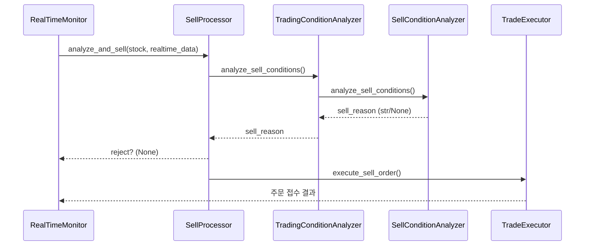

# 매도 판단 로직 문서

## 1. 목적 및 적용 범위
본 문서는 알고리즘 트레이딩 시스템에서 **실시간 주식 매도 여부**를 결정하는 로직의 구조와 세부 동작을 설명합니다. 대상 코드는 `trade/*` 및 `trade/realtime/*` 하위 모듈에 구현된 매도 관련 컴포넌트이며, 실제 주문은 KIS OpenAPI 를 사용합니다.

## 2. 주요 클래스·파일 위치
| 레이어 | 클래스 / 모듈 | 주요 책임 |
| ------ | ------------- | -------- |
| Realtime Monitor | `trade/realtime/sell_processor.py` (`SellProcessor`) | 종목별 실시간 매도 분석·주문 실행 파이프라인 |
| Condition Analysis | `trade/trading_condition_analyzer.py` (`TradingConditionAnalyzer`) | 시장 단계 판단, 세부 분석 위임 |
| Condition Scoring | `trade/sell_condition_analyzer.py` (`SellConditionAnalyzer`) | 우선순위 기반 매도 사유 결정 |
| Order Execution | `trade/trade_executor.py` (`TradeExecutor`) | 리스크 점검 후 KIS API 매도 주문 |

## 3. 전체 흐름도


## 4. 단계별 상세 설명
### 4-1. SellProcessor 선행 체크
1. **실시간 가격 필수**: `current_price` ≤ 0 이면 즉시 Reject
2. **result 카운트**: `result_dict['signaled'/'ordered']` 업데이트
3. **매도 주문 실행**: `TradeExecutor.execute_sell_order()` 호출 및 성공 여부 로그

### 4-2. TradingConditionAnalyzer 내부 흐름
1. **시장 단계 결정**: `get_market_phase()` → `opening / active / lunch / pre_close / closing / closed`
2. **SellConditionAnalyzer 위임**: 단계·실시간 데이터·설정 dict 전달
3. 반환된 `sell_reason`이 `None`이면 매도 불가, 문자열이면 매도 진행

### 4-3. SellConditionAnalyzer 우선순위 기반 조건
아래 조건을 **상위 → 하위** 순서로 평가하며, 첫 번째로 충족된 사유를 반환합니다.

| 우선순위 | 카테고리 | 대표 설정 키 (기본값) | 매도 사유 |
| -------- | -------- | -------------------- | ---------- |
| 1 | 즉시 매도(리스크) | `emergency_stop_loss_rate` (-5%), `emergency_volatility_threshold` (3.0) | `trading_halt`, `market_close`, `emergency_stop` |
| 2 | 손절 | `stop_loss_rate` (-2%), `rapid_decline_from_buy_threshold` (2.5%) | `stop_loss`, `time_based_stop_loss`, `rapid_decline_from_buy`, `high_volatility_rapid_decline` |
| 3 | 익절 | `take_profit_rate`, `preclose_profit_threshold` (0.5%), `long_hold_profit_threshold` (0.3%) | `take_profit`, `pre_close_profit`, `long_hold_profit` |
| 4a | 기술적 지표 | `weak_contract_strength_threshold` (80), `low_buy_ratio_threshold` (30) | `weak_contract_strength`, `low_buy_ratio`, `market_pressure_sell` |
| 4b | 호가 불균형 | `high_ask_pressure_threshold` (3.0), `wide_spread_threshold` (0.03) | `high_ask_pressure`, `low_bid_interest`, `wide_spread_liquidity` |
| 4c | 거래량 패턴 | `volume_drying_threshold` (0.4), `low_turnover_threshold` (0.5%) | `volume_drying_up`, `low_volume_turnover`, `volume_pattern_weak` |
| 4d | 체결 불균형 | `sell_dominance_threshold` (0.7) | `sell_contract_dominance`, `weak_strength_prolonged`, `very_weak_strength`, `combined_sell_pressure` |
| 5 | 변동성 급등 | `high_volatility_threshold` (5.0) | `high_volatility_decline` |
| 6 | 시간 기반 | `max_holding_minutes` (240) | `holding_period`, `opportunity_cost` |

> 설정값 조회 우선순위는 `strategy_config` → `risk_config` → `performance_config` 입니다.

### 4-4. 손익·보유시간 계산 핵심 코드
```python
current_pnl_rate = (current_price - stock.buy_price) / stock.buy_price * 100  # 손익률 %
holding_minutes = (now_kst() - stock.order_time).total_seconds() / 60         # 보유 시간(분)

# 동적 손절률 산정 예시
a = risk_config['stop_loss_rate']           # 예: -0.02 (소수)
mult = 1.0 if holding_minutes <= 30 else 0.8 if holding_minutes <= 120 else 0.6 if holding_minutes <= 240 else 0.4
stop_loss_threshold = a * mult * 100        # 동일 % 단위로 변환
```

### 4-5. TradeExecutor 리스크 검증 & 주문 실행
* 일일 손실·거래 횟수·포지션 수·단일 포지션 크기 검증 후 `get_order_cash(ord_dv="sell", ...)` 호출
* 성공 시 `StockStatus.SELL_ORDERED` 상태 변경 및 익절/손절가 초기화

## 5. 핵심 설정(抜粹)
| Config 파일 | 키 | 기본값 | 설명 |
| ------------ | -- | ------ | ---- |
| `strategy_config` | emergency_stop_loss_rate | -5.0 | 급락 긴급 손절(%) |
| 〃 | weak_contract_strength_threshold | 80 | 체결강도 약화 기준 |
| 〃 | high_ask_pressure_threshold | 3.0 | 매도호가/매수호가 ≥3 |
| `risk_config` | stop_loss_rate | -0.02 | 기본 손절(-2%) |
| 〃 | max_holding_minutes | 240 | 최대 보유 4시간 |
| `performance_config` | min_holding_minutes_before_sell | 1 | 쿨다운 최소 보유(분) |

> 실제 값은 `config/trading_config.ini` 및 환경별 설정 파일에서 변경 가능합니다.

## 6. 참고용 개선 아이디어
* **트레일링 스탑 / 이동손절** – 변동성 기반 자동 스탑가 조정
* **AI 기반 기회비용 평가** – 포트폴리오 α 대비 비효율 포지션 자동 청산
* **멀티스레드 최적화** – SellConditionAnalyzer 병렬화로 처리 지연 최소화
* **글로벌 마켓 데이터 연계** – 지수 급변·선물 동조 시 방어적 매도

---
문서 업데이트 : {{date}} 