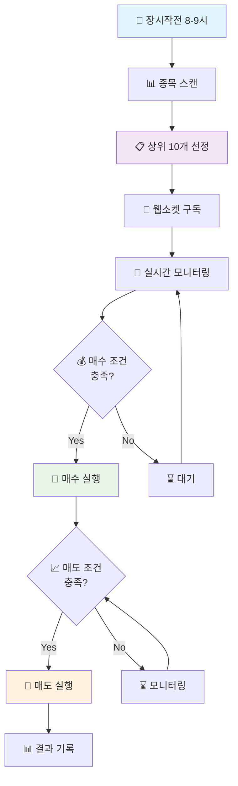
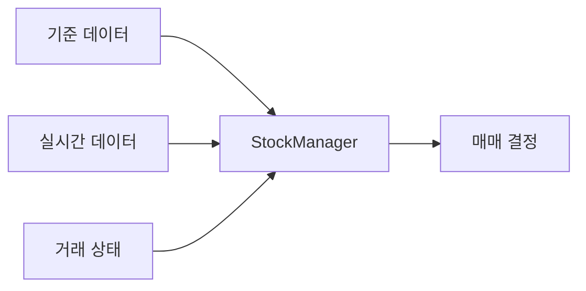

# 🤖 AutoTrade 시스템 거래 플로우

## 📊 전체 거래 프로세스

## 🕐 시간대별 시스템 동작

### 장시작전 (08:00 - 09:00)
- **종목 스캔**: 기술적 분석 기반 종목 선별
- **상위 선정**: 패턴 점수 기준 상위 10개 종목 선택
- **웹소켓 준비**: 선정 종목 실시간 데이터 구독 준비

### 장시간 (09:00 - 15:30)
- **실시간 모니터링**: 30초 주기 데이터 분석
- **매수/매도 신호**: 조건 충족시 자동 거래 실행
- **포지션 관리**: 손익 모니터링 및 리스크 관리

### 장마감 후 (15:30 이후)
- **결과 분석**: 일일 거래 성과 리포트
- **데이터 정리**: 다음날 준비를 위한 데이터 정리

## 🎯 핵심 전략

### 종목 선정 기준
- **기술적 지표**: RSI, 이동평균, 패턴 분석
- **유동성**: 일평균 거래대금 1억원 이상
- **변동성**: 적정 변동성 범위 (3-8%)
- **섹터 분산**: 리스크 분산을 위한 업종 다양성

### 매수 조건
- 저항선 돌파 확인
- 거래량 급증 (평균 대비 150% 이상)
- 호가창 매수 우세도 확인
- 상승 모멘텀 지속성 검증

### 매도 조건
- 목표 수익률 달성 (2-3%)
- 손절 기준 도달 (-2%)
- 거래량 감소 및 모멘텀 약화
- 장마감 30분 전 일괄 정리

## 🔧 시스템 구성요소

### 데이터 관리

### 모듈 구조
- **MarketScanner**: 종목 스캔 및 선정
- **StockManager**: 종목 데이터 관리
- **RealtimeMonitor**: 실시간 모니터링
- **TradeExecutor**: 주문 실행
- **WebSocketManager**: 실시간 데이터 수신

## 📈 성과 지표

### 추적 메트릭
- **승률**: 수익 거래 / 전체 거래
- **평균 수익률**: 거래당 평균 수익
- **최대 낙폭**: 최대 손실 구간
- **샤프 비율**: 위험 대비 수익률
- **거래 빈도**: 일평균 거래 횟수

### 리스크 관리
- **포지션 크기**: 전체 자금의 10% 이하
- **일일 손실 한도**: 전체 자금의 2% 이하
- **최대 동시 보유**: 10개 종목 이하
- **집중도 제한**: 단일 섹터 30% 이하

---

## 🚀 사용법

1. **시스템 시작**: `python main.py`
2. **상태 확인**: 로그 파일 모니터링
3. **성과 분석**: 일일 리포트 확인
4. **파라미터 조정**: `config/trading_config.ini` 수정

## 📞 문의 및 지원

- **로그 위치**: `logs/` 디렉토리
- **설정 파일**: `config/trading_config.ini`
- **디버그 도구**: `debug/` 디렉토리의 각종 테스트 스크립트 